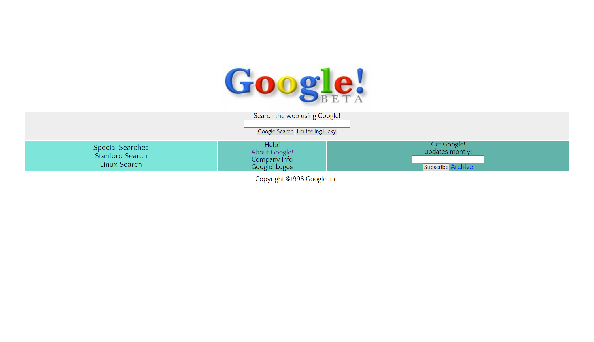

# Recreating Google1998

Recreating Google1998 by using a referance. I retrieved color codes and font family by extracting data from [here.](https://elgoog.im/google1998/)

## Table of contents

  - [Screenshot](#screenshot)
  - [Links](#links)
  - [Author](#author)

### Screenshot

### Links

- Live Site URL: [Click here](https://ozlemxates.github.io/Google1998re.create/)

### Author

- GitHub - [ozlemxates](https://github.com/ozlemxates)
- Frontend Mentor - [@ozlemxates](https://www.frontendmentor.io/profile/ozlemxates)

### Thank you for checking out! 🎉